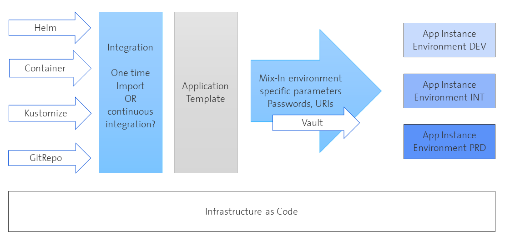

# Tanzu Community Edition 0.11 - Tanzu packages
## Tanzu Packages
Tanzu packages are leveraging Carvel's open source component [kapp](https://tanzu.vmware.com/developer/guides/kapp-gs/) with its own way to implement kubernetes manifest templating (like [Helm](https://helm.sh/) and [Kustomize](https://kustomize.io/)). For now, let's leave the implementation details and check how they are used. 



This diagram shows the challenges for reliable kubernetes packaging. 

There are different sources already introduced like helm repositories. If you do not start from scratch and want to rely on a vendors helm repo, you might want to continously integrate with new releases of this repo. The integration part can be done with a lot of scripting tools, the [toolchain introduced and maintained by VMware](https://tanzu.vmware.com/content/blog/introducing-k14s-kubernetes-tools-simple-and-composable-tools-for-application-deployment) addresses a lot of these common issues like templating, image management, catalog bundling, support of air-gapped environments.

The second customization step is currentyl not fully addressed with the proposed tool chain. Very crucial for productive environment is handling of secrets and certificates, usually externalized by a vault like CyberArk or [HashiCorp Vault](https://vdan.niceneasy.ch/secure-prometheus-configuration-with-hashicorp-vault-on-k8s/). There are other interesting solutions like [sealed secrets](https://github.com/bitnami-labs/sealed-secrets) or [CSI implementations](https://learn.hashicorp.com/tutorials/vault/kubernetes-secret-store-driver) together with strict security recommendations regarding RBAC for personal access that might help to mitigate the security risks involved in storing secrets - and helping not to find them in Git repositories anymore. I am using hashicorp vault with the CSI driver and will go in further details in the last part.

Now let's jump into the process directly at the application template in the diagram above: in case of TCE, these templates are defined as tanzu package catalog that you can load like any other container:

```bash
tanzu package repository add tce-repo --url projects.registry.vmware.com/tce/main:0.11.0 --namespace tanzu-package-repo-global
```
This installes the packages defined in this container on the given namespace. You can now check what's available on your system:

```bash
tanzu package repository list --all-namespaces
tanzu package available list --all-namespaces
tanzu package installed list --all-namespaces
```

You can install the packages from the TCE catalog one by one in any combination, or you can try the [app-toolkit](https://tanzucommunityedition.io/docs/v0.11/package-readme-app-toolkit-0.1.0/). 

*The files I am referencing throughout my blog post can be found [here](https://github.com/bluebossa63/tce-0.11.0).*

Bundling requires aggregating all needed values into one component ([common value file](../../app-toolkit/values.yaml)) - this can be done but needs to be tested on the individual package level anyway. So I followed the lead of the contents of the app-toolkit and installed everything individually - adding harbor and the recommendation of [this vsphere must-read on monitoring](https://tanzucommunityedition.io/docs/v0.11/vsphere-monitoring-stack/):

```bash
tanzu package install cert-manager --package-name cert-manager.community.tanzu.vmware.com --version 1.6.1

#create custom certificate authority CA and cluster issuer
kubens cert-manager
kubectl create secret tls niceneasy-ca --cert=/home/daniele/CA/ca.niceneasy.ch.crt --key=/home/daniele/CA/ca.niceneasy.ch.key
kubectl apply -f cert-manager/cluster-issuer.yaml 
#create custom certificate authority

tanzu package install contour --package-name contour.community.tanzu.vmware.com --version 1.20.1 --values-file contour/contour-values.yaml 

tanzu package install prometheus --package-name prometheus.community.tanzu.vmware.com --version 2.27.0-1 --values-file prometheus/prometheus-values.yaml

tanzu package install grafana --package-name grafana.community.tanzu.vmware.com --version 7.5.11 --values-file grafana/grafana-values.yaml

tanzu package install harbor --package-name harbor.community.tanzu.vmware.com --version 2.3.3 --values-file harbor/harbor-values.yaml

tanzu package install cartographer --package-name cartographer.community.tanzu.vmware.com --version 0.2.2

tanzu package install fluxcd-source-controller -p fluxcd-source-controller.community.tanzu.vmware.com -v 0.21.2

tanzu package install cert-injection-webhook --package-name cert-injection-webhook.community.tanzu.vmware.com --version 0.1.0 -f ./cert-injection-webhook/cert-injection-webhook-config-values.yaml

tanzu package install knative-serving --package-name knative-serving.community.tanzu.vmware.com --version 1.0.0 --values-file knative-serving/knative-serving-values.yml 

tanzu package install kpack --package-name kpack.community.tanzu.vmware.com --version 0.5.1 -f ./kpack/kpack-values.yaml

# see registry-creds: https://github.com/pivotal/kpack/blob/main/docs/secrets.md and https://docs.vmware.com/en/VMware-Tanzu-Kubernetes-Grid/1.5/vmware-tanzu-kubernetes-grid-15/GUID-cluster-lifecycle-secrets.html
```
For each of the packages you'll find a setup description in the docs together with some first setup tests. If you have everything in place, I recommend running the app-tools and the kpack tests. 
> As I am using my own harbor registry with a self-signed certificate or untrusted CA, I had some issues until I checked out the cert-injection-webhook. It is very common to introduce a self-signed certificate in development environments - leveraging cert-manager and cert-injection-webhook automate the publication of custom CAs. If you don't want to deal with these details, just use a public repository with valid certificates. Otherwise you have to tackle the bootstrapping problem to avoid certificate errors. Please remember, it is best practice to inject custom CAs already in the k8s nodes during the creation of the cluster as mentioned in a special paragraph above. With cert-injection-webhook a lot of flexibility is added but this is only applicable within containers. The containerd processes on the nodes will still use the CAs registered in the OS. 
>
> A very extensive covering on certificate injection with a similar component offered by cert-manager directly can be found [here](https://medium.com/trendyol-tech/manage-kubernetes-admission-webhooks-certificates-with-cert-manager-ca-injector-and-vault-pki-281b065e1044).

OK, now I had some additional tools on the plate to create the management cluster of my developer dreams:

- metallb
- argocd
- hashicorp vault
- nexus (maven and other repo types)
- jenkins (nice to have)
- plex (just for fun)

So I decided to try out the package management system proposed by TCE. You will find my test [here](../../packaging/), just cd in and try it out yourself following [the documentation](https://tanzucommunityedition.io/docs/v0.11/package-creation-step-by-step/). Again: subject of automation if you want to do continuous delivery of external sources of manifests.

```bash
tanzu package repository add niceneasy.ch --url bluebossa63/dev-tools-tanzu-package:0.1.0 --namespace tanzu-package-repo-global
```
installes the result onto your cluster provided as is. Honestly, I took the shortcut and did not externalize a lot of configuration values. It was more a test of the overall handling for me. But everything lays there and should be easily adaptable.

## Some feedback on the Tanzu tooling

I had some issues setting the registry credentials correctly and honestly, I did not fully understand the concept of this redundancy in holding secrets in plain k8s or via tanzu utilities. And honestly, sometimes it really gets a bit weird:

tanzu apps workload create -f workload.yaml

is the same as

kubectl apply -f workload.yaml

I question the effort to create such redundancies, why not stick to the concept to use CRDs directly. This is also my preferred way to create workload clusters. I have seen the same development on openshift installations: a bunch of tools is evolving to address tasks like registry mirroring for air-gapped environments together with catalog-management. I have the impression the different players are not collaborating to standardize more - this could backfire by adding even more complexity if you want to support all packaging implementations or you have to support multiple vendors.

Something different are utilities like

kp build logs <build-name>

aggregating the logs is very handy in this case.


